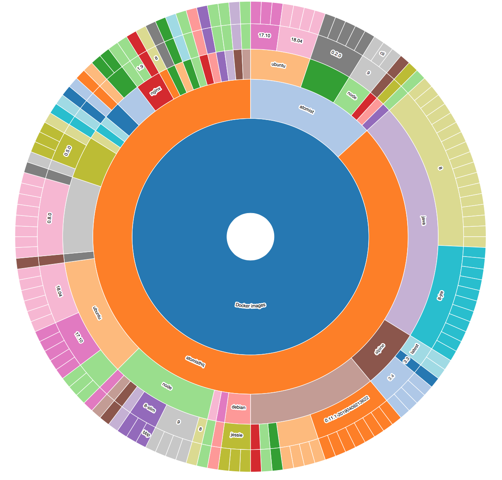

  

# @atomist/org-visualizer

A tool for visualizing technology usage and drift across an organization. 

The cloud native era has led to an explosion of repositories, which we lack tools to understand and manage at scale. See Rod Johnson's blogs [This Will Surprise You](https://blog.atomist.com/this-will-surprise-you/) and [What's Lurking in Your Repositories](https://blog.atomist.com/whats-lurking/) for further discussion.

An Atomist **aspect** captures a concern in code or process. Aspects can access anything held in git: code and configuration and git data such as branch counts and committer activity. With the Atomist event hub, aspects can also capture data from your process, such as the characteristics of a push, build time and outcome.

Aspects support the following use cases:

1. *Visualization* (all aspects): See usage and drift across your organization.
2. *Convergence* (some aspects): Help drive code changes to achieve consistency on an ideal state of an aspect, such as a particularly version of a library.
3. *Reaction to change* (some aspects): React to changes in aspect usage within a project: for example, to a library upgrade, removing a Spring Boot Security starter or exposing an additional port in a Docker container.

This project focuses on the visualization use case. Visualizations are exposed via d3 sunburst charts and via a REST API returning JSON documents.

There is out of the box
support for investigating the following aspects of your project:

- TypeScript version
- Spring Boot version and starters (with Maven)
- Docker base images, Dockerfile path and exposed ports
- Java build tool (Maven, Gradle)
- Library versions (npm, Maven, Python)
- Inclusion of a code of conduct
- Common CI tools
- git activity and branch count

This repository also serves as an incubator for aspects that may graduate into other Atomist open source projects.

Analysis is extensible using the Atomist `Project` API. Implementing and registering additional aspect result in additional visualization links after re-analysis and restarting the application.

An example visualization, showing Docker images used across two GitHub organizations:


## Running in Docker

To try this program without installing anything (except Docker), you can use the Docker image. Start org_visualizer in Docker, then send commands to get it to analyze repositories (on your computer or from GitHub), then look at the results in your browser.

### Start the SDM in Docker

Run this:

`docker run -it --rm -p 2866:2866 -v /path/to/your/local/repositories:/root/atomist/projects --name org-visualizer atomist/org-visualizer`

Which means:

`docker run` says to start up a container.

`-it` says, keep it interactive in the current terminal.

`-p 2866:2866` makes the SDM's web interface available outside the container.

`--rm` says, remove the container after it shuts down. (I've never not wanted this option to `docker run`)

The `-v /path/to/your/local/repositories:/root/atomist/projects` part is optional. If you want to analyze repositories that exist on your computer, this will give the container access to them at `/root/atomist/projects`.

`--name org-visualizer` lets you reference the container, as in the next section.

`atomist/org-visualizer` is the name of the image on Docker Hub.

Docker will download the image and then start up the SDM. The terminal will print a summary of the SDM when it's done with startup. This includes:

```
  SDM
    Org Visualizer  started in local mode
```

and then some other stuff. You can also find the link to the web interface:

```
  Atomist Visualizations
    http://localhost:2866/overview
```

(Ctrl-C will exit. But leave it running for the rest of this activity.)

### Send analysis commands

Analysis is triggered at the command line. Use Docker to run the command line inside the container you just started.

For example:

`docker exec -it org-visualizer sh -c "atomist analyze github organization"`

Here, `docker exec` says "run this command in the named docker container."

`-it` makes it an interactive terminal command.

`org-visualizer` is the name of the docker container, from the `--name` option to `docker run` above.

`sh -c` says "Here's a command to run in shell"

`"atomist analyze github organization"` is the shell command to run, in quotes. Here, it's requesting an analysis of a GitHub
organization. It'll prompt you for the name of the organization.

For other analysis commands to run, see [below](#analyze-your-repositories).

### Look at the results

Find the interface at: http://localhost:2866/overview

When you want to modify this program to make your own aspects, proceed with running this app on your laptop.

## Running

To visualize your GitHub or local repositories:

1. Clone and build this project
2. Set up the required PostgreSQL database
3. Start the `org-visualizer` software delivery machine
4. Run analysis on your repositories via the Atomist CLI
5. Hit the web interface at [http://localhost:2866](http://localhost:2866)
6. If you have more ideas, add code to study more aspects of your projects

### Building

Please use Node 10+. You'll need node and git. For `npm ci`, You'll also need developer tools like python, make, etc. On a Mac, that's XCode command line tools. On ubuntu, that's `sudo apt-get install build-essentials.`

First, install with `npm ci`.

Next, build with `npm run build`

### Database setup

To skip this section, [run in docker](#running-in-docker).

#### Install PostgreSQL

Running locally requires a local database. This gives you a handy window into the data as well, if you're comfortable with SQL databases.

On a Mac: installing [PostgresApp](https://postgresapp.com/) will make all of this just work.

Otherwise, you need the following (example commands are for Ubuntu):

* postgresql is installed: `sudo apt-get postgresql postgresql-contrib`
* the server is started, and listening on the default port: `sudo service postgresql start`
* your username also has a database user, and that user is superuser: `createdb $(whoami)`
* your username can also connect with a password. See [Connecting](#connecting-to-the-database) for where to put that.

#### Creating the Database

Data about your repositories are stored locally in a PostgreSQL database.

Before starting to use `org-visualizer`, you need to create the required database by running the following command:

```
$ npm run db:create
```

To clean up and remove the database, run:

```
$ npm run db:delete
```

#### Connecting to the Database

For anything other than the default PostgreSQL [connection parameters](https://node-postgres.com/features/connecting) and db `org_viz`:

Configure the PostgreSQL database details in `client.config.json` in your `~/.atomist`:

```json
{
  "sdm": {
    "postgres": {
      "user": "<postgres user>",
      "password": "<postgres password>",
      "host": "<postgres host>",
      "port": "<postgres port>",
      "database": "org_viz"
    }
  }
}
```

If `~/.atomist/client.config.json` does not exist, create it with the above content.

### Other Dependencies

You will need the following installed on your machine for the out of the box aspects to work:

- The `git` binary.
- Java
  - A JDK (*not* a JRE)
  - Maven - `mvn` must be on the path. 
- Node
- npm

`git` is always required. Java or Node binaries are required only if working with those technologies in the projects you are analyzed.

All artifacts referenced in Maven or Node projects must be accessible when the analysis runs. You can check this by manually running `mvn` or `npm i` on the relevant projects.

### Analyze your repositories

The `analyze` command is exposed by this org-visualizer project.
It works as at Atomist command, which runs through the `atomist` CLI.

#### Prerequisites

Either [run the org_visualizer in Docker](#running-in-docker) or:

* install the CLI: `npm i -g @atomist/cli`
* start the org_visualizer (in the org_visualizer project): `atomist start --local`

#### GitHub

To analyze a GitHub organization, run the following command:

```
atomist analyze github organization
```

Enter the GitHub owner name (e.g., `atomist`) at the prompt. Alternatively you can specify the owner parameter as a CLI argument to skip the prompt, as follows:

```
atomist analyze github organization --owner atomist
```

_To access private repositories, ensure that your GitHub token is available to 
Node processes via a `GITHUB_TOKEN` environment variable._

#### Local directories
To analyze local directories, wherever they were cloned from, specify the full path of the parent directory of the repositories, as follows: 

```
 atomist analyze local repositories --localDirectory /my/absolute/path/

```
> The directories must be `git` projects.

#### General

>Run `atomist analyze [local|github]` with `--update true` flag to force updates to existing analyses. Do this if you have updated your analyzer code. (See *Extending* below.) 

Use the `--cloneUnder [dir]` option to supply a stable directory under which all cloning should be performed. This will make subsequent analysis runs quicker.
Otherwise, temporary files will be used.

>If using a stable directory, make sure the directory exists and is writable
by the `org-visualizer` process. And keep an eye on disk usage, as these directories
are not transient and will not be deleted automatically.

### Run the web app

When the server is running with `atomist start --local`, you can see the visualizations.

Go to [http://localhost:2866](http://localhost:2866).

## Lifecycle
Atomist aspect functionality isn't limited to analyzing repositories. It is intended to be built into your delivery process, via an [Atomist SDM](https://github.com/atomist/sdm). This will ensure that your analyzes are always up to date, and that fingerprints can be extracted by delivery events such as builds.

### Fingerprinting on Push
The `org-visualizer` open source server is an SDM, meaning it can react to delivery events in repositories it manages. Running locally, it works with directories under a given base directory (by default, `~/atomist/projects/`), in which Atomist git hooks have been introduced.

Please refer to the `atomist clone` command for further information.

This SDM reacts to any push to the default branch of any managed repositories, calculating fingerprints.

### Delivery events
Atomist is designed to work with a wide range of events, not merely pushes. 

This SDM reacts to pushes of Maven projects and will attempt to build them, in order to trigger the [build time aspect](https://github.com/atomist/sdm-pack-aspect/blob/8457fd82fe8027e143f217dc62ded8ad50a622dc/lib/aspect/delivery/BuildAspect.ts#L71) that demonstrates the intersection of aspects with the delivery process. As your projects build, build time information will appear on the `org-visualizer` dashboard.

The build goal is set in [index.ts](https://github.com/atomist/org-visualizer/blob/d99fdefd9d2331b14848dc8e666a05aef250f5f4/index.ts#L107) by the following code:

```typescript
return {
    // Fingerprint every push to default branch
    fingerprint: {
        test: ToDefaultBranch,
        goals: pushImpact,
    },
    // We know how to build Maven projects
    build: {
        test: IsMaven,
        goals: build,
    },
};
```  

> Atomist is a powerful delivery orchestration engine. An SDM can coordinate other tools, automatically fix code. See [Why You Need an SDM](https://the-composition.com/why-you-need-a-software-delivery-machine-85e8399cdfc0). See the [Atomist samples repository](https://github.com/atomist/samples) for examples of SDM configurations.

When using the Atomist service, event handling is automatically handled for repositories on GitHub, BitBucket or GitLab.

## Architecture

There are three architectural layers:

1. **Fingerprint extraction**. This is enabled by implementing [Aspects](lib/aspect/aspects.ts). Aspects know how to take **fingerprints** (extractions of small relevant bits) of the code, compare them, and even update them. Analysis is triggered by `atomist analyze` or by an SDM in response to a push.
2. **API** layer. Once your server is running, see the Swagger API documentation at [http://localhost:2866/api-docs](http://localhost:2866/api-docs)
3. Simple **UI** using static React and d3 exposing sunburst charts based on the API.

## Extending

This project includes some well known aspects but it is intended for you to add your own.

Do this by updating the `aspects` function defined in the [`aspects.ts`](lib/aspect/aspects.ts) file. Simply add aspects to this array:

```typescript
export function aspects(): Aspect[] {
    return [
        DockerFrom,
        TypeScriptVersion,
        //... add your aspects here
```

>After updating your code you will need to rerun existing analyses. Run `atomist analyze [local|github] --update true` again to force updates on existing data.

See the [developer guide](https://github.com/atomist/sdm-pack-aspect/blob/master/docs/developer.md) for more information.

## Next Steps
The [Atomist](https://www.atomist.com) service keeps analyses up to date automatically across all your repositories. It can also help to achieve consistency and convergence in eligible aspects by updating projects, and enabling workflows on change.

See [https://docs.atomist.com/developer/](https://docs.atomist.com/developer/) for further information.

-----

Created by [Atomist][atomist].
Need Help?  [Join our Slack workspace][slack].

[atomist]: https://atomist.com/ (Atomist - How Teams Deliver Software)
[slack]: https://join.atomist.com/ (Atomist Community Slack)
